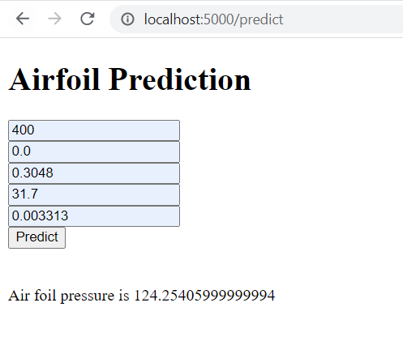
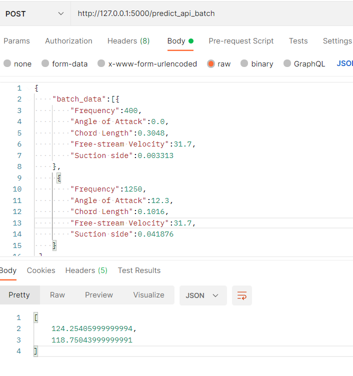
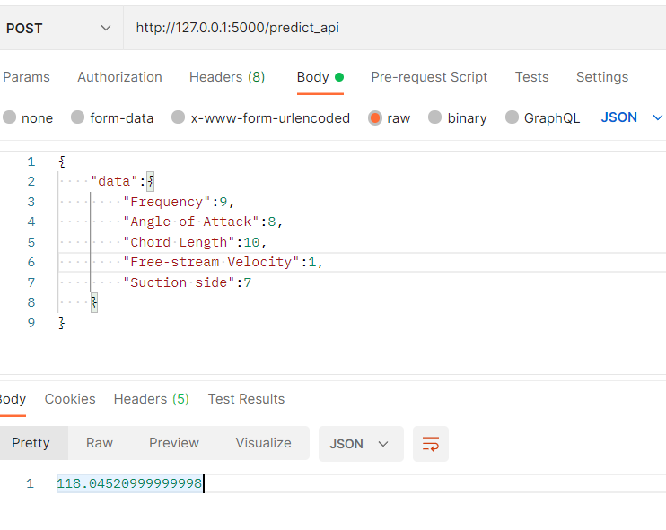
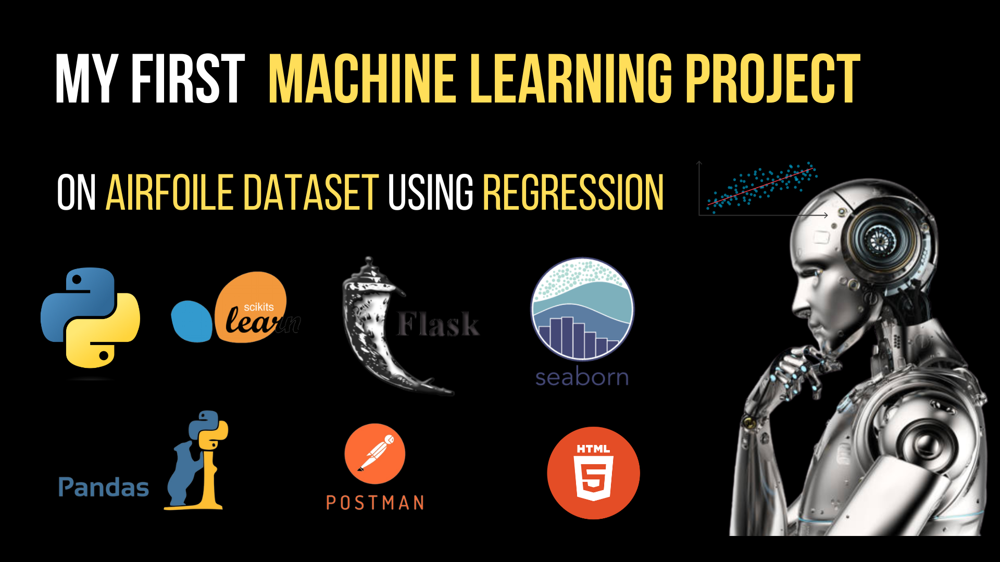

# airfoil_regression_with_flask_api

## Steps that I followed

- Dataset - https://archive.ics.uci.edu/ml/datasets/Airfoil+Self-Noise 
- I studied about the dataset and the following features are
  - Independent features :  {Frequency,Angle of Attack, Chord length,Free-stream velocity, Suction side displacement thickness}
  - Dependent features : {Scaled sound pressure leve}

1. Null values  
  - I  checked if there are any null values
  
2. I analysed the different categories of the output feature, and understood that , there are many categories, and it cannot be a classification problem statement, and it is a regression problem statement
   - I predicted the dependent feature with the help of Independent features
   
3. I used various regression models like Linear Regression model (linear,ridge,lasso ) , KNN Regressor, SVR regressor(linear,poly,rbf,sigmoid,precomputed) , DecisionTreeRegressor,RandomForestRegressor
4. I analysed the performance of each model , using r2_score metrics 
5. Random Forest model is the most accurate model with 93% accuracy.
 
  ### Why random forest model was the most acccurate model ?

  - Random forest is a  machine learning algorithm that can be used for both regression and classification tasks. 

  - Random forests are built by constructing multiple decision trees, each trained on a subset of the data and a subset of the features. The final prediction is made by taking the average (or majority vote, in classification problems) of the predictions from each tree. This approach can help to mitigate the overfitting that can occur with individual decision trees, and can result in more accurate predictions.

  1. Non-linearity: Random forest is able to capture non-linear relationships between the input features and the target variable. This is because it uses decision trees, which are capable of modeling complex relationships between variables. By combining the predictions of multiple decision trees, random forest is able to capture a wide range of non-linear relationships.

  2. Robustness to outliers: Random forest is less sensitive to outliers than some other regression models, such as linear regression. Outliers are data points that are significantly different from the rest of the data and can have a disproportionate effect on the model. Random forest is able to mitigate the effect of outliers by averaging the predictions of multiple decision trees.

  3. Overfitting: Overfitting is a common problem in machine learning where the model becomes too complex and starts to fit the noise in the data rather than the underlying relationship. Random forest is less prone to overfitting than some other models, such as decision trees. This is because it uses multiple decision trees and combines their predictions, which helps to reduce the risk of overfitting.

  4. Feature importance: Random forest provides a measure of variable importance, which can be useful in identifying which features are most important in predicting the target variable. This information can be used to guide feature selection and improve the overall accuracy of the model.

  5. Easy to use: Random forest is relatively easy to use and requires little to no data preprocessing. It also works well with high-dimensional datasets, making it a useful tool for many different types of regression problems.

  Overall, random forest is a powerful and effective regression model that is able to capture complex non-linear relationships and mitigate the effects of outliers and overfitting

## steps that I followed (continued)

6. Then I  saved this model as  a pickle file , which helps to convert a model into serialized object in bytes , without having to train the model again and again to test it. It also helps to load the model easily
7. I created a Flask API to serve the model with API , get the input from the user , pass it to the model and predict the output. 
  - First API => was to serve the model to the users using html output , it takes single input of all the independent features and predicts the output and sends the output back to the user and displays in home.html  page
    
    
  - Second API  => was to serve the model to the users using postman , JSON single input of all the independent features and predict the output and returns jsonified output to the user.
     
  - third API => was to serve the model to the users using postman. Batch JSON input of all the independent features and predicts the output and returns jsonified batch output to the users
      
      
8. Please reach me out in linkedin or my email if you have any doubts or suggestions regarding this project,
9. Also reach me out in linkedin or my email, if you have any opportunities as Data Aanlyst,Machine Learning Engineer,Data Scientist.

thankyou for reading this till the end.
  
## Explaination through video

